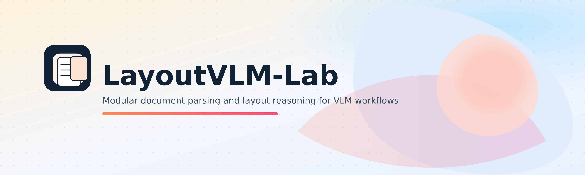
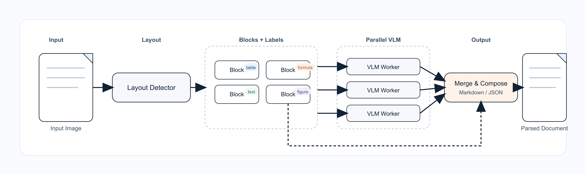

<h1 align="center">LayoutVLM-Lab</h1>

<div align="center">
  English | <a href="./README_zh-CN.md">简体中文</a>
</div>

<p align="center">
  
</p>

<p align="center">
  
  
  
</p>

LayoutVLM-Lab is a modular document parsing framework designed to **evaluate and compare your own VLMs** on real document layouts. It lets you swap Layout and VLM components, run them at scale, and export consistent outputs for objective assessment.

## Why LayoutVLM-Lab

- Built for **benchmarking self-trained VLMs** on document parsing tasks
- Interchangeable Layout/VLM implementations via registries
- Unified outputs (Markdown + JSON) for reliable comparisons
- A high-concurrency pipeline for batch processing

## Quickstart

```bash
pip install -e .
cp .env.example .env
python run.py -c config/paddle_layoutv2.yaml
```

## Output Structure

Default output is `./results/<experiment.name>/`:
- `*.md` Markdown (saved directly in this folder)
- `json/*.json` structured results
- `imgs/*` cropped images (optional)

## Installation

Core dependencies only (no Paddle):
```bash
pip install -e .
```

Install PP-DocLayoutV2 example dependencies (optional):
```bash
pip install paddlepaddle-gpu==3.2.0 -i https://www.paddlepaddle.org.cn/packages/stable/cu126/
pip install -U "paddleocr[doc-parser]"
```

Note

  1. `paddlepaddle-gpu` requires the official CUDA wheel index (example for CUDA 12.6)

  1. Paddle and vLLM can conflict when installed in the same environment. Install vLLM in a separate environment, then deploy your VLM model from that environment.

## vLLM Serve

Before running, deploy the model first and ensure the model path is accessible.

```bash
CUDA_VISIBLE_DEVICES=0,1 \
  vllm serve Qwen/Qwen3-VL-32B-Instruct \
  --served-model-name Qwen3-VL \
  --port 7670 \
  --dtype bfloat16 \
  --tensor-parallel-size 2 \
  --pipeline_parallel_size 1 \
  --data-parallel-size 1 \
  --max_model_len 22000 \
  --max_num_batched_tokens 8192 \
  --enable_chunked_prefill \
  --gpu-memory-utilization 0.9
```

## Configuration

Copy and edit environment variables:
```bash
cp .env.example .env
```

Example config: `config/paddle_layoutv2.yaml`. Key sections:
- `experiment` / `output`: run naming and output base directory
- `input`: image folder and filtering behavior
- `pipeline`: concurrency settings
- `layout` / `vlm`: backend selection and model settings
- Full reference: `docs/config_reference.md`

## Documentation

- [Custom layout tutorial](docs/custom_layout.md)
- [Configuration reference](docs/config_reference.md)

## Architecture Overview

<p align="center">
  
</p>


## OmniDocBench Results

### Our implementation (PP-DocLayoutV2 + Qwen3-VL)

<table style="width:100%; border-collapse: collapse;">
  <thead>
    <tr>
      <th>Model</th>
      <th>Overall ↑</th>
      <th>Text Edit ↓</th>
      <th>Formula CDM ↑</th>
      <th>Table TEDS ↑</th>
      <th>Table TEDS-S ↑</th>
      <th>Read Order Edit ↓</th>
    </tr>
  </thead>
  <tbody>
    <tr>
      <td>Qwen3-VL-4B</td>
      <td>90.850</td>
      <td>0.039</td>
      <td>91.130</td>
      <td>85.320</td>
      <td>89.812</td>
      <td>0.041</td>
    </tr>
    <tr>
      <td>Qwen3-VL-32B</td>
      <td>93.349</td>
      <td>0.038</td>
      <td>92.745</td>
      <td>91.101</td>
      <td>95.102</td>
      <td>0.042</td>
    </tr>
  </tbody>
</table>

### Leaderboard (OmniDocBench v1.5)

<table style="width:100%; border-collapse: collapse;">
  <thead>
    <tr>
      <th>Model Type</th>
      <th>Methods</th>
      <th>Size</th>
      <th>Overall ↑</th>
      <th>Text Edit ↓</th>
      <th>Formula CDM ↑</th>
      <th>Table TEDS ↑</th>
      <th>Table TEDS-S ↑</th>
      <th>Read Order Edit ↓</th>
    </tr>
  </thead>
  <tbody>
    <tr>
      <td rowspan="4"><strong>Specialized</strong><br><strong>VLMs</strong></td>
      <td>PaddleOCR-VL</td>
      <td>0.9B</td>
      <td><strong>92.86</strong></td>
      <td><strong>0.035</strong></td>
      <td><strong>91.22</strong></td>
      <td><strong>90.89</strong></td>
      <td><strong>94.76</strong></td>
      <td><strong>0.043</strong></td>
    </tr>
    <tr>
      <td>MinerU2.5</td>
      <td>1.2B</td>
      <td><ins>90.67</ins></td>
      <td><ins>0.047</ins></td>
      <td><ins>88.46</ins></td>
      <td><ins>88.22</ins></td>
      <td><ins>92.38</ins></td>
      <td><ins>0.044</ins></td>
    </tr>
    <tr>
      <td>MonkeyOCR-pro-3B</td>
      <td>3B</td>
      <td>88.85</td>
      <td>0.075</td>
      <td>87.25</td>
      <td>86.78</td>
      <td>90.63</td>
      <td>0.128</td>
    </tr>
    <tr>
      <td>OCRVerse</td>
      <td>4B</td>
      <td>88.56</td>
      <td>0.058</td>
      <td>86.91</td>
      <td>84.55</td>
      <td>88.45</td>
      <td>0.071</td>
    </tr>
    <tr>
      <td rowspan="3"><strong>General</strong><br><strong>VLMs</strong></td>
      <td>Qwen3-VL-235B-A22B-Instruct</td>
      <td>235B</td>
      <td>89.15</td>
      <td>0.069</td>
      <td>88.14</td>
      <td>86.21</td>
      <td>90.55</td>
      <td>0.068</td>
    </tr>
    <tr>
      <td>Gemini-2.5 Pro</td>
      <td>-</td>
      <td>88.03</td>
      <td>0.075</td>
      <td>85.82</td>
      <td>85.71</td>
      <td>90.29</td>
      <td>0.097</td>
    </tr>
    <tr>
      <td>Qwen2.5-VL</td>
      <td>72B</td>
      <td>87.02</td>
      <td>0.094</td>
      <td>88.27</td>
      <td>82.15</td>
      <td>86.22</td>
      <td>0.102</td>
    </tr>
    <tr>
      <td rowspan="2"><strong>Pipeline</strong><br><strong>Tools</strong></td>
      <td>PP-StructureV3</td>
      <td>-</td>
      <td>86.73</td>
      <td>0.073</td>
      <td>85.79</td>
      <td>81.68</td>
      <td>89.48</td>
      <td>0.073</td>
    </tr>
    <tr>
      <td>Mineru2-pipeline</td>
      <td>-</td>
      <td>75.51</td>
      <td>0.209</td>
      <td>76.55</td>
      <td>70.90</td>
      <td>79.11</td>
      <td>0.225</td>
    </tr>
  </tbody>
</table>

<p><em>Source: OmniDocBench official leaderboard — <a href="https://github.com/opendatalab/OmniDocBench">GitHub repository</a>.</em></p>

## Extensibility

- Register new implementations in `LAYOUT_REGISTRY` / `VLM_REGISTRY`
- PP-DocLayoutV2 is an example implementation, not a required dependency

## TODO

- [ ] Add non-OpenAI VLM adapters (local models, other APIs)
- [ ] Add PDF input support (PDF -> images pipeline)

