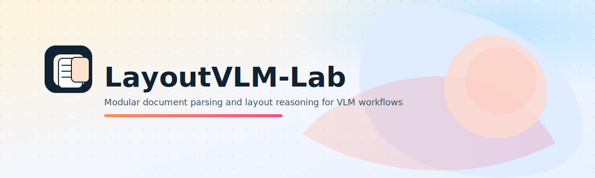
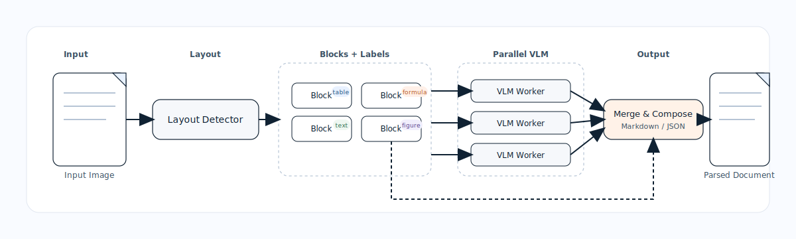

<h1 align="center">LayoutVLM-Lab</h1>

<div align="center">
  <a href="./README.md">English</a> | 简体中文
</div>

<p align="center">
  
</p>

<p align="center">
  
  
  
</p>

LayoutVLM-Lab 是一个模块化文档解析框架，旨在在真实文档布局上**评估并对比你自己的 VLM**。它支持替换 Layout 与 VLM 组件、进行大规模运行，并导出一致输出以便客观评测。

## 为什么选择 LayoutVLM-Lab

- 面向文档解析任务的**自训练 VLM 基准评测**
- 通过注册表实现 Layout/VLM 可替换
- 统一输出（Markdown + JSON）便于可靠对比
- 高并发流水线用于批量化处理

## 快速开始

```bash
pip install -e .
cp .env.example .env
python run.py -c config/paddle_layoutv2.yaml
```

## 输出结构

默认输出到 `./results/<experiment.name>/`：
- `*.md` Markdown（直接保存在该目录）
- `json/*.json` 结构化结果
- `imgs/*` 裁剪图（可选）

## 安装

仅核心依赖（不含 Paddle）：
```bash
pip install -e .
```

安装 PP-DocLayoutV2 示例依赖（可选）：
```bash
pip install paddlepaddle-gpu==3.2.0 -i https://www.paddlepaddle.org.cn/packages/stable/cu126/
pip install -U "paddleocr[doc-parser]"
```

注意事项

  1. `paddlepaddle-gpu` 需要使用官方 CUDA wheel 索引（示例 CUDA 12.6）

  2. Paddle 与 vLLM 在同一环境中安装可能会产生冲突，建议将 vLLM 安装在独立环境中，再从该环境部署 VLM 模型。

## vLLM Serve

运行前请先部署模型，并确保模型路径可访问。

```bash
CUDA_VISIBLE_DEVICES=0,1 \
  vllm serve Qwen/Qwen3-VL-32B-Instruct \
  --served-model-name Qwen3-VL \
  --port 7670 \
  --dtype bfloat16 \
  --tensor-parallel-size 2 \
  --pipeline_parallel_size 1 \
  --data-parallel-size 1 \
  --max_model_len 22000 \
  --max_num_batched_tokens 8192 \
  --enable_chunked_prefill \
  --gpu-memory-utilization 0.9
```

## 配置

复制并编辑环境变量：
```bash
cp .env.example .env
```

示例配置：`config/paddle_layoutv2.yaml`。关键部分：
- `experiment` / `output`：实验名称与输出根目录
- `input`：输入图片目录与过滤策略
- `pipeline`：并发设置
- `layout` / `vlm`：后端选择与模型配置
- 完整参数参考：`docs/config_reference.md`

## 文档

- [自定义 Layout 教程](docs/custom_layout.md)
- [配置参数参考](docs/config_reference.md)

## 架构概览

<p align="center">
  
</p>

## OmniDocBench 结果

### 我们的实现（PP-DocLayoutV2 + Qwen3-VL）

<table style="width:100%; border-collapse: collapse;">
  <thead>
    <tr>
      <th>模型</th>
      <th>Overall ↑</th>
      <th>Text Edit ↓</th>
      <th>Formula CDM ↑</th>
      <th>Table TEDS ↑</th>
      <th>Table TEDS-S ↑</th>
      <th>Read Order Edit ↓</th>
    </tr>
  </thead>
  <tbody>
    <tr>
      <td>Qwen3-VL-4B</td>
      <td>90.850</td>
      <td>0.039</td>
      <td>91.130</td>
      <td>85.320</td>
      <td>89.812</td>
      <td>0.041</td>
    </tr>
    <tr>
      <td>Qwen3-VL-32B</td>
      <td>93.349</td>
      <td>0.038</td>
      <td>92.745</td>
      <td>91.101</td>
      <td>95.102</td>
      <td>0.042</td>
    </tr>
  </tbody>
</table>

### 排行榜（OmniDocBench v1.5）

<table style="width:100%; border-collapse: collapse;">
  <thead>
    <tr>
      <th>模型类型</th>
      <th>方法</th>
      <th>规模</th>
      <th>Overall ↑</th>
      <th>Text Edit ↓</th>
      <th>Formula CDM ↑</th>
      <th>Table TEDS ↑</th>
      <th>Table TEDS-S ↑</th>
      <th>Read Order Edit ↓</th>
    </tr>
  </thead>
  <tbody>
    <tr>
      <td rowspan="4"><strong>专用</strong><br><strong>VLMs</strong></td>
      <td>PaddleOCR-VL</td>
      <td>0.9B</td>
      <td><strong>92.86</strong></td>
      <td><strong>0.035</strong></td>
      <td><strong>91.22</strong></td>
      <td><strong>90.89</strong></td>
      <td><strong>94.76</strong></td>
      <td><strong>0.043</strong></td>
    </tr>
    <tr>
      <td>MinerU2.5</td>
      <td>1.2B</td>
      <td><ins>90.67</ins></td>
      <td><ins>0.047</ins></td>
      <td><ins>88.46</ins></td>
      <td><ins>88.22</ins></td>
      <td><ins>92.38</ins></td>
      <td><ins>0.044</ins></td>
    </tr>
    <tr>
      <td>MonkeyOCR-pro-3B</td>
      <td>3B</td>
      <td>88.85</td>
      <td>0.075</td>
      <td>87.25</td>
      <td>86.78</td>
      <td>90.63</td>
      <td>0.128</td>
    </tr>
    <tr>
      <td>OCRVerse</td>
      <td>4B</td>
      <td>88.56</td>
      <td>0.058</td>
      <td>86.91</td>
      <td>84.55</td>
      <td>88.45</td>
      <td>0.071</td>
    </tr>
    <tr>
      <td rowspan="3"><strong>通用</strong><br><strong>VLMs</strong></td>
      <td>Qwen3-VL-235B-A22B-Instruct</td>
      <td>235B</td>
      <td>89.15</td>
      <td>0.069</td>
      <td>88.14</td>
      <td>86.21</td>
      <td>90.55</td>
      <td>0.068</td>
    </tr>
    <tr>
      <td>Gemini-2.5 Pro</td>
      <td>-</td>
      <td>88.03</td>
      <td>0.075</td>
      <td>85.82</td>
      <td>85.71</td>
      <td>90.29</td>
      <td>0.097</td>
    </tr>
    <tr>
      <td>Qwen2.5-VL</td>
      <td>72B</td>
      <td>87.02</td>
      <td>0.094</td>
      <td>88.27</td>
      <td>82.15</td>
      <td>86.22</td>
      <td>0.102</td>
    </tr>
    <tr>
      <td rowspan="2"><strong>Pipeline</strong><br><strong>工具</strong></td>
      <td>PP-StructureV3</td>
      <td>-</td>
      <td>86.73</td>
      <td>0.073</td>
      <td>85.79</td>
      <td>81.68</td>
      <td>89.48</td>
      <td>0.073</td>
    </tr>
    <tr>
      <td>Mineru2-pipeline</td>
      <td>-</td>
      <td>75.51</td>
      <td>0.209</td>
      <td>76.55</td>
      <td>70.90</td>
      <td>79.11</td>
      <td>0.225</td>
    </tr>
  </tbody>
</table>

<p><em>来源：OmniDocBench 官方排行榜 — <a href="https://github.com/opendatalab/OmniDocBench">GitHub 仓库</a>。</em></p>

## 可扩展性

- 通过 `LAYOUT_REGISTRY` / `VLM_REGISTRY` 注册新实现
- PP-DocLayoutV2 为示例实现，并非硬性依赖

## TODO

- [ ] 添加非 OpenAI 的 VLM 适配器（本地模型或其他 API）
- [ ] 增加 PDF 输入支持（PDF -> images pipeline）

